| Nama      | Aditya Bani Isro |
| ----------- | ----------- |
| NIM     | 312010134       |
| Kelas   | TI.20.A.1        |

# Praktikum 6 | Web Framework

# DAFTAR TUGAS

<table border="2" cellpading="10">
  <tr>
    <td><b>Praktikum 1</b></td>
    <td>HTML Dasar</td>
    <td><a href="https://github.com/Aditya-Bani/lab1web">Klik disini</td>
  </tr>
  <tr>
    <td><b>Praktikum 2</b></td>
    <td>CSS Dasar</td>
    <td><a href="https://github.com/Aditya-Bani/lab2web">Klik disini</td>
  </tr>
  <tr>
    <td><b>Praktikum 3</b></td>
    <td>Membuat List, Table dan Form</td>
    <td><a href="https://github.com/Aditya-Bani/lab3web">Klik disini</td>
  </tr>
  <tr>
    <td><b>Praktikum 4</b></td>
    <td>CSS Layout</td>
    <td><a href="https://github.com/Aditya-Bani/lab4web">Klik disini</td>
  </tr>
  <tr>
  <td><b>Praktikum 5</b></td>
    <td>Javascript</td>
    <td><a href="https://github.com/Aditya-Bani/lab5web">Klik disini</td>
</tr>
<tr>
  <td><b>Praktikum 6</b></td>
    <td>Web Framework</td>
    <td><a href="https://github.com/Aditya-Bani/lab6web">Klik disini</td>
</tr>
<tr>
  <td><b>Praktikum 7</b></td>
    <td>PHP Dasar</td>
    <td><a href="https://github.com/Aditya-Bani/lab7web">Klik disini</td>
</tr>
<tr>
  <td><b>Praktikum 8</b></td>
    <td>PHP dan Database MySQL</td>
    <td><a href=https://github.com/Aditya-Bani/lab8web">Klik disini</td>
</tr>
<tr>
  <td><b>Praktikum 9 & 10</b></td>
    <td>PHP Modular</td>
    <td><a href="https://github.com/Aditya-Bani/lab9web">Klik disini</td>
</tr>
<tr>
  <td></td>
    <td>PHP OOP</td>
    <td><a href="https://github.com/Aditya-Bani/lab10web">Klik disini</td>
</tr>
<tr>
    <td><b>Praktikum 11</b></td>
    <td>PHP Framework (Codeigniter)</td>
    <td><a href="https://github.com/Aditya-Bani/lab11web">Klik disini</td>
  </tr>
<tr>
    <td><b>Praktikum 12</b></td>
    <td>Framework Lanjutan (CRUD)</td>
    <td><a href="https://github.com/Aditya-Bani/lab11web">Klik disini</td>
  </tr>
<tr>
    <td><b>Praktikum 13</b></td>
    <td>Framework Lanjutan (Modul Login)</td>
    <td><a href="https://github.com/Aditya-Bani/lab11web">Klik disini</td>
  </tr>
  <tr>
    <td><b>Praktikum 14</b></td>
    <td>Pagination dan Pencarian</td>
    <td><a href="https://github.com/Aditya-Bani/lab11web">Klik disini</td>
  </tr>
  <tr>
</table>_________________________________________________________________________________
_________________________________________________________________________________

## Langkah langkah praktikum 6

## 1. Buat folder baru dengan nama lab6_css_framework, Buat file baru dokumen html

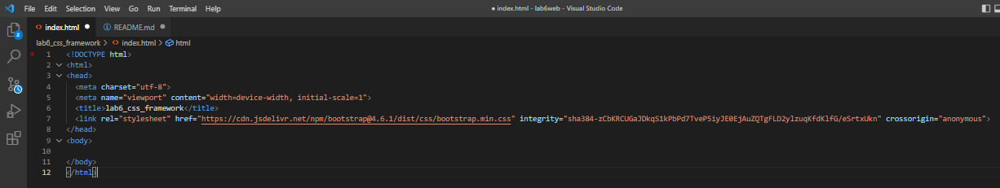

## 2. Buatlah layout web sederhana menggunakan css frameword (Twitter Bootsrtap)

### 1. Quick start
Buka web https://getbootstrap.com Disini saya memakai Bootstrap 4. Copy atau download CSS & JS Bootstrap, Saya memilih copy

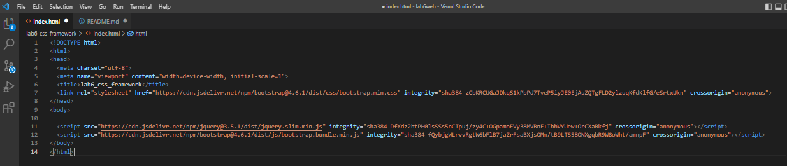

### 2. Navbar
Buat komponen website yang berupa menu. yang biasanya diletakkan pada header website.

Untuk mencari component klik menu documentation pada web bootstrap

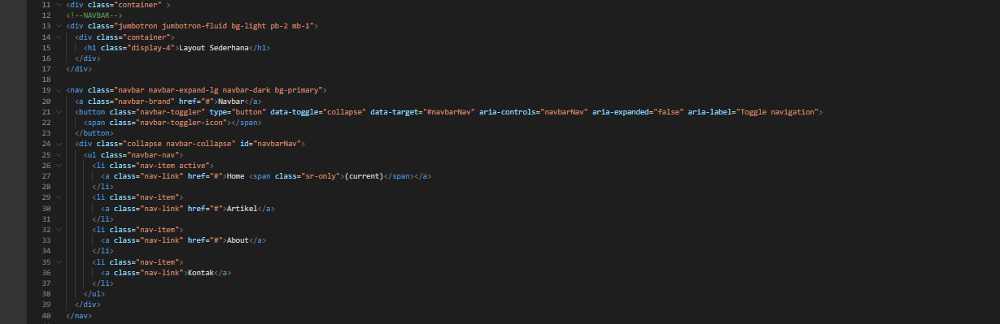

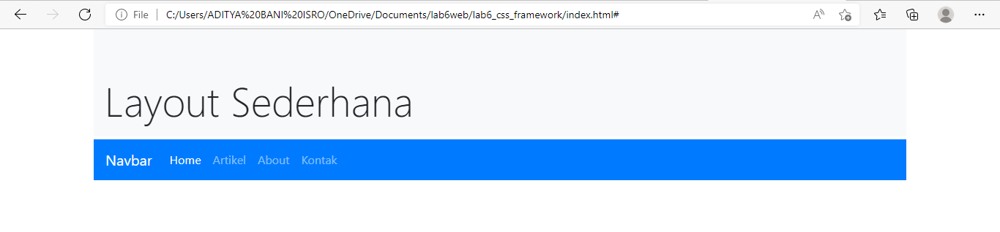

### 3. Jumbotron
Selanjutnya buat jumbotron atau area besar pada Bootstrap, umumnya digunakan untuk menampilkan sebuah infromasi penting.

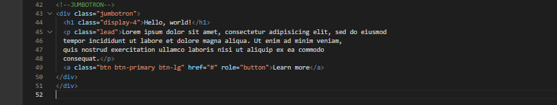

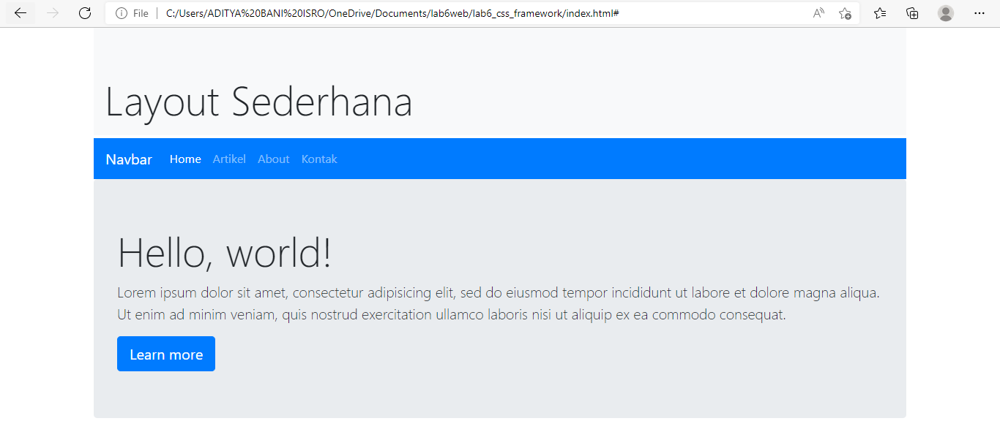

### 4. Cards
Untuk membuat body konten, saya menggunakan cards. 

pertama saya akan membagi kolom menggunakan display flex agar dapat memuat 2 kolom yang nanti akan di isi oleh menu List Group

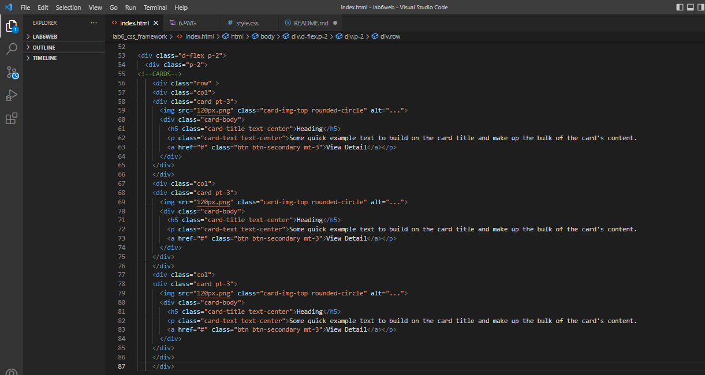

Penjelasan :

`col` memberi style sebuah table berdasarkan kolom tertentu 

`img-rounded-circle` untuk membuat border pada gambar menjadi bulat

`pt-3` padding top = 3

`mt-3` margin top = 3

saya menambah style untuk mengatur ukuran dan posisi pada gambar

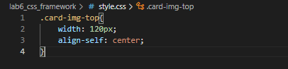

refresh browser

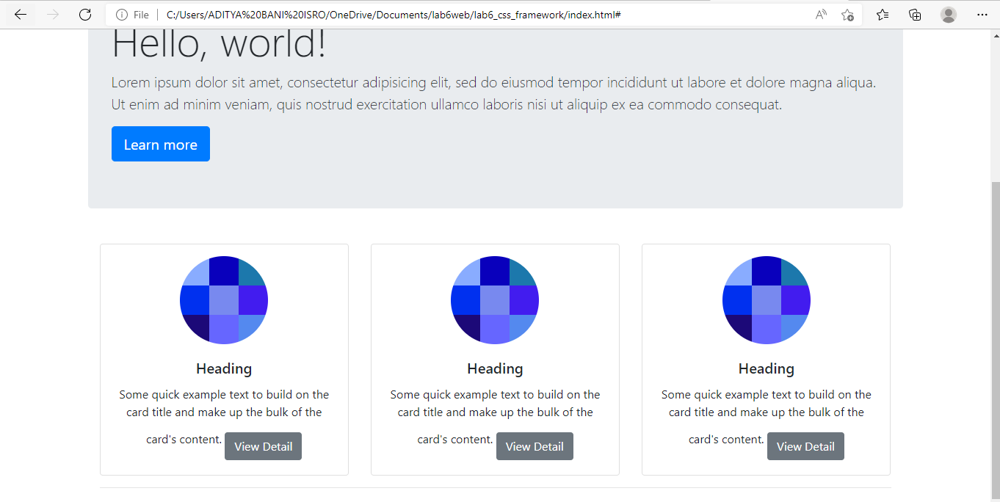

### 5. List Group
lalu tambahkan widget disamping kanan cards

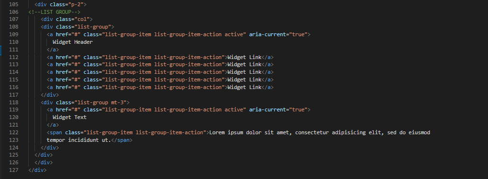

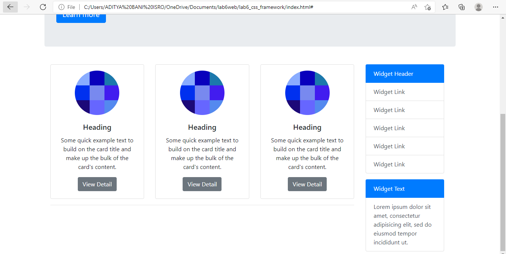

### 6. Cards 2
Buat body konten untuk yg kedua, dan masih menggunakan card

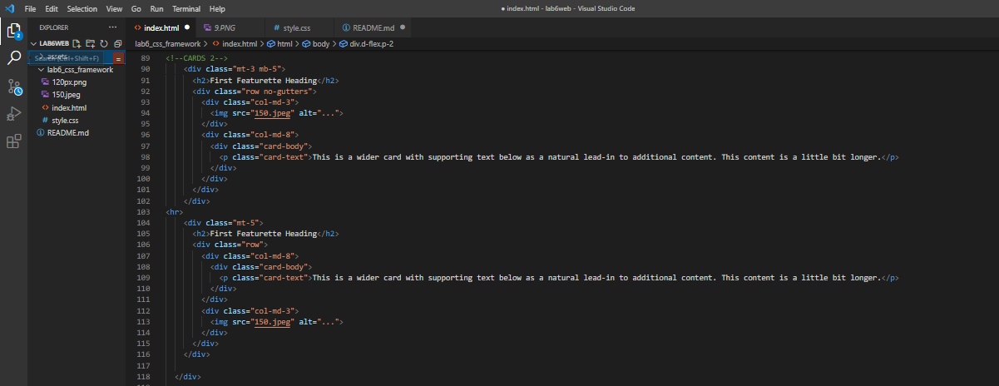

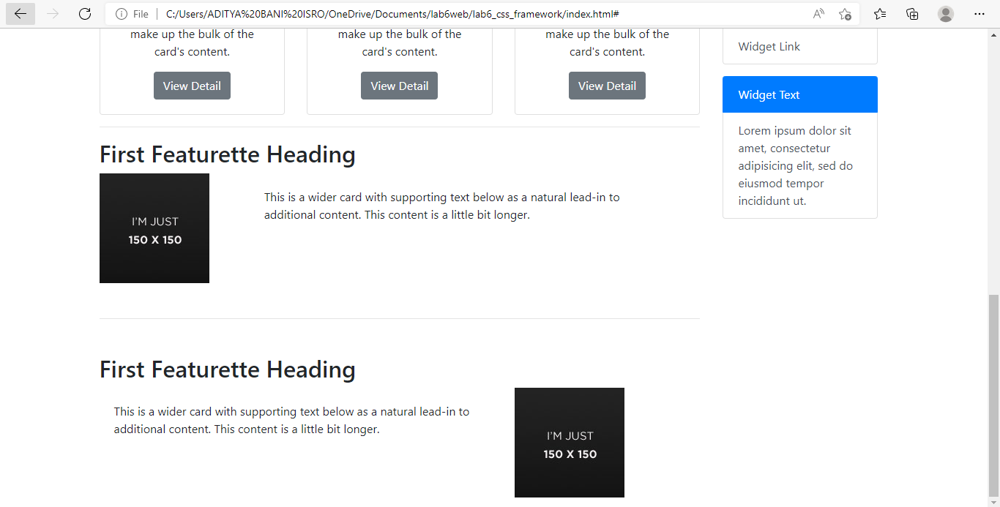

### 7. Footer 
bagian akhir tambahkan footer.

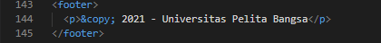

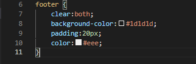

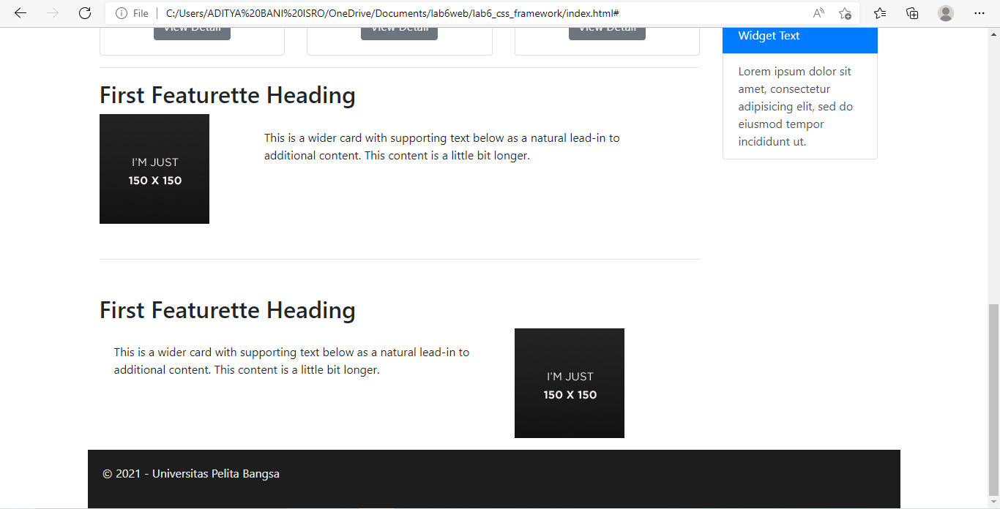

## Tampilan full

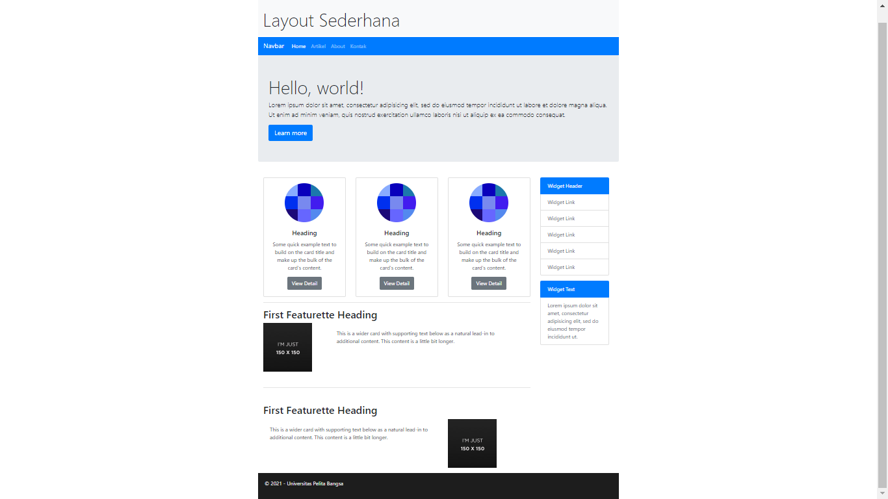
